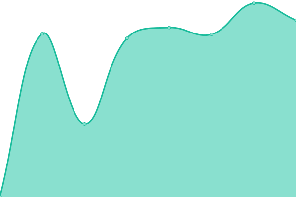
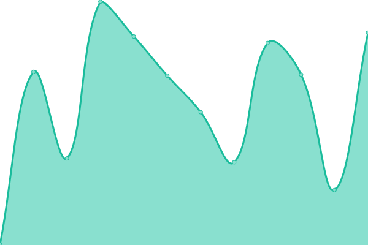
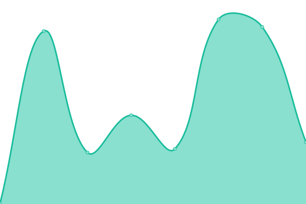
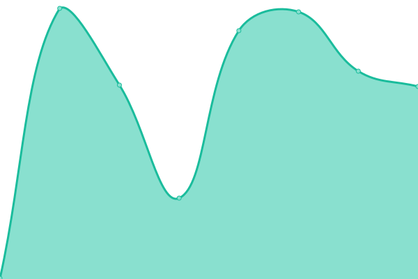

# [📈 Live Status](https://status.api.sjc3.rackspacecloud.com/): <!--live status--> **🟩 All systems operational**

This repository contains the open-source uptime monitor and status page for [Rackspace Flex API Status](https://status.api.sjc3.rackspacecloud.com/), powered by [Upptime](https://github.com/upptime/upptime).

With [Upptime](https://upptime.js.org), you can get your own unlimited and free uptime monitor and status page, powered entirely by a GitHub repository. We use [Issues](https://github.com/rackerlabs/rs-flex-uptime/issues) as incident reports, [Actions](https://github.com/rackerlabs/rs-flex-uptime/actions) as uptime monitors, and [Pages](https://status.api.sjc3.rackspacecloud.com/) for the status page.

<!--start: status pages-->
<!-- This summary is generated by Upptime (https://github.com/upptime/upptime) -->
<!-- Do not edit this manually, your changes will be overwritten -->
<!-- prettier-ignore -->
| URL | Status | History | Response Time | Uptime |
| --- | ------ | ------- | ------------- | ------ |
|  [nova-api](https://nova.api.sjc3.rackspacecloud.com) | 🟩 Up | [nova-api.yml](https://github.com/rackerlabs/rs-flex-uptime/commits/HEAD/history/nova-api.yml) | 

 339ms
     
 | 

<a href="https://status.api.sjc3.rackspacecloud.com/history/nova-api">98.58%</a>
    

|  [neutron-api](https://neutron.api.sjc3.rackspacecloud.com) | 🟩 Up | [neutron-api.yml](https://github.com/rackerlabs/rs-flex-uptime/commits/HEAD/history/neutron-api.yml) | 

 644ms
     
 | 

<a href="https://status.api.sjc3.rackspacecloud.com/history/neutron-api">98.68%</a>
    

|  [keystone-api](https://keystone.api.sjc3.rackspacecloud.com/v3) | 🟩 Up | [keystone-api.yml](https://github.com/rackerlabs/rs-flex-uptime/commits/HEAD/history/keystone-api.yml) | 

 286ms
     
 | 

<a href="https://status.api.sjc3.rackspacecloud.com/history/keystone-api">98.71%</a>
    

|  [octavia-api](https://octavia.api.sjc3.rackspacecloud.com) | 🟩 Up | [octavia-api.yml](https://github.com/rackerlabs/rs-flex-uptime/commits/HEAD/history/octavia-api.yml) | 

 264ms
     
 | 

<a href="https://status.api.sjc3.rackspacecloud.com/history/octavia-api">98.85%</a>
    

|  [glance-api](https://glance.api.sjc3.rackspacecloud.com) | 🟩 Up | [glance-api.yml](https://github.com/rackerlabs/rs-flex-uptime/commits/HEAD/history/glance-api.yml) | 

 253ms
     
 | 

<a href="https://status.api.sjc3.rackspacecloud.com/history/glance-api">98.79%</a>
    

|  [heat-api](https://heat.api.sjc3.rackspacecloud.com) | 🟩 Up | [heat-api.yml](https://github.com/rackerlabs/rs-flex-uptime/commits/HEAD/history/heat-api.yml) | 

 238ms
     
 | 

<a href="https://status.api.sjc3.rackspacecloud.com/history/heat-api">99.01%</a>
    

|  [cinder-api](https://cinder.api.sjc3.rackspacecloud.com) | 🟩 Up | [cinder-api.yml](https://github.com/rackerlabs/rs-flex-uptime/commits/HEAD/history/cinder-api.yml) | 

 238ms
     
 | 

<a href="https://status.api.sjc3.rackspacecloud.com/history/cinder-api">99.06%</a>
    

|  [cloudformation-api](https://cloudformation.api.sjc3.rackspacecloud.com) | 🟩 Up | [cloudformation-api.yml](https://github.com/rackerlabs/rs-flex-uptime/commits/HEAD/history/cloudformation-api.yml) | 

 233ms
     
 | 

<a href="https://status.api.sjc3.rackspacecloud.com/history/cloudformation-api">99.10%</a>
    

|  [placement-api](https://placement.api.sjc3.rackspacecloud.com) | 🟩 Up | [placement-api.yml](https://github.com/rackerlabs/rs-flex-uptime/commits/HEAD/history/placement-api.yml) | 

 222ms
     
 | 

<a href="https://status.api.sjc3.rackspacecloud.com/history/placement-api">99.25%</a>
    

|  [barbican-api](https://barbican.api.sjc3.rackspacecloud.com) | 🟩 Up | [barbican-api.yml](https://github.com/rackerlabs/rs-flex-uptime/commits/HEAD/history/barbican-api.yml) | 

 233ms
     
 | 

<a href="https://status.api.sjc3.rackspacecloud.com/history/barbican-api">99.29%</a>
    

|  [magnum-api](https://magnum.api.sjc3.rackspacecloud.com) | 🟩 Up | [magnum-api.yml](https://github.com/rackerlabs/rs-flex-uptime/commits/HEAD/history/magnum-api.yml) | 

 311ms
     
 | 

<a href="https://status.api.sjc3.rackspacecloud.com/history/magnum-api">99.39%</a>
    

<!--end: status pages-->

[**Visit our status website →**](https://status.api.sjc3.rackspacecloud.com/)

## 📄 License

- Powered by: [Upptime](https://github.com/upptime/upptime)
- Code: [MIT](./LICENSE) © [Anand Chowdhary](https://anandchowdhary.com), supported by [Pabio](https://pabio.com)
- Data in the `./history` directory: [Open Database License](https://opendatacommons.org/licenses/odbl/1-0/)
