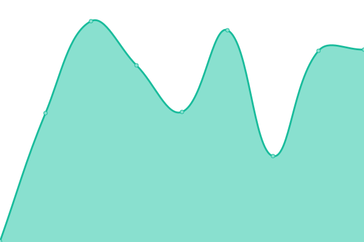
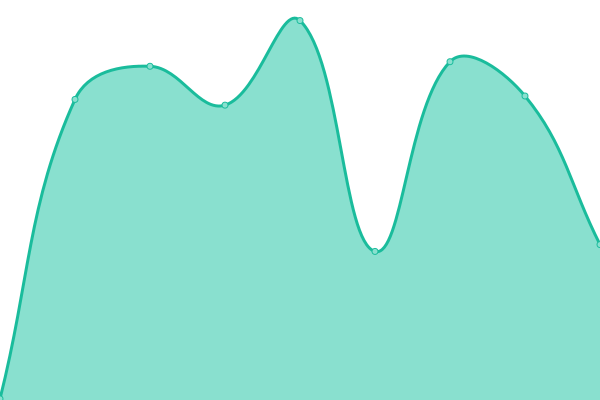
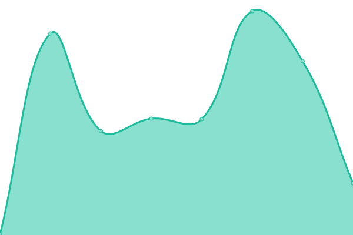

# [📈 Live Status](https://the2hill.github.io/rs-flex-uptime): <!--live status--> **🟩 All systems operational**

This repository contains the open-source uptime monitor and status page for [phillip.toohill](https://the2hill.github.io/rs-flex-uptime), powered by [Upptime](https://github.com/upptime/upptime).

With [Upptime](https://upptime.js.org), you can get your own unlimited and free uptime monitor and status page, powered entirely by a GitHub repository. We use [Issues](https://github.com/the2hill/rs-flex-uptime/issues) as incident reports, [Actions](https://github.com/the2hill/rs-flex-uptime/actions) as uptime monitors, and [Pages](https://the2hill.github.io/rs-flex-uptime) for the status page.

<!--start: status pages-->
<!-- This summary is generated by Upptime (https://github.com/upptime/upptime) -->
<!-- Do not edit this manually, your changes will be overwritten -->
<!-- prettier-ignore -->
| URL | Status | History | Response Time | Uptime |
| --- | ------ | ------- | ------------- | ------ |
|  [nova-api](https://nova.api.sjc3.rackspacecloud.com) | 🟩 Up | [nova-api.yml](https://github.com/the2hill/rs-flex-uptime/commits/HEAD/history/nova-api.yml) | 

 238ms
     
 | 

<a href="https://the2hill.github.io/rs-flex-uptime/history/nova-api">100.00%</a>
    

|  [neutron-probe](https://neutron.api.sjc3.rackspacecloud.com) | 🟩 Up | [neutron-probe.yml](https://github.com/the2hill/rs-flex-uptime/commits/HEAD/history/neutron-probe.yml) | 

 223ms
     
 | 

<a href="https://the2hill.github.io/rs-flex-uptime/history/neutron-probe">100.00%</a>
    

|  [keystone-probe](https://keystone.api.sjc3.rackspacecloud.com/v3) | 🟩 Up | [keystone-probe.yml](https://github.com/the2hill/rs-flex-uptime/commits/HEAD/history/keystone-probe.yml) | 

 213ms
     
 | 

<a href="https://the2hill.github.io/rs-flex-uptime/history/keystone-probe">100.00%</a>
    

|  [octavia-probe](https://octavia.api.sjc3.rackspacecloud.com) | 🟩 Up | [octavia-probe.yml](https://github.com/the2hill/rs-flex-uptime/commits/HEAD/history/octavia-probe.yml) | 

 560ms
     
 | 

<a href="https://the2hill.github.io/rs-flex-uptime/history/octavia-probe">99.56%</a>
    

|  [glance-probe](https://glance.api.sjc3.rackspacecloud.com) | 🟩 Up | [glance-probe.yml](https://github.com/the2hill/rs-flex-uptime/commits/HEAD/history/glance-probe.yml) | 

 211ms
     
 | 

<a href="https://the2hill.github.io/rs-flex-uptime/history/glance-probe">100.00%</a>
    

|  [heat-probe](https://heat.api.sjc3.rackspacecloud.com) | 🟩 Up | [heat-probe.yml](https://github.com/the2hill/rs-flex-uptime/commits/HEAD/history/heat-probe.yml) | 

 189ms
     
 | 

<a href="https://the2hill.github.io/rs-flex-uptime/history/heat-probe">100.00%</a>
    

|  [cinder-probe](https://cinder.api.sjc3.rackspacecloud.com) | 🟩 Up | [cinder-probe.yml](https://github.com/the2hill/rs-flex-uptime/commits/HEAD/history/cinder-probe.yml) | 

 180ms
     
 | 

<a href="https://the2hill.github.io/rs-flex-uptime/history/cinder-probe">100.00%</a>
    

|  [cloudformation-probe](https://cloudformation.api.sjc3.rackspacecloud.com) | 🟩 Up | [cloudformation-probe.yml](https://github.com/the2hill/rs-flex-uptime/commits/HEAD/history/cloudformation-probe.yml) | 

 184ms
     
 | 

<a href="https://the2hill.github.io/rs-flex-uptime/history/cloudformation-probe">100.00%</a>
    

|  [placement-probe](https://placement.api.sjc3.rackspacecloud.com) | 🟩 Up | [placement-probe.yml](https://github.com/the2hill/rs-flex-uptime/commits/HEAD/history/placement-probe.yml) | 

 173ms
     
 | 

<a href="https://the2hill.github.io/rs-flex-uptime/history/placement-probe">100.00%</a>
    

|  [barbican-probe](https://barbican.api.sjc3.rackspacecloud.com) | 🟩 Up | [barbican-probe.yml](https://github.com/the2hill/rs-flex-uptime/commits/HEAD/history/barbican-probe.yml) | 

 190ms
     
 | 

<a href="https://the2hill.github.io/rs-flex-uptime/history/barbican-probe">100.00%</a>
    

|  [magnum-probe](https://magnum.api.sjc3.rackspacecloud.com) | 🟩 Up | [magnum-probe.yml](https://github.com/the2hill/rs-flex-uptime/commits/HEAD/history/magnum-probe.yml) | 

 188ms
     
 | 

<a href="https://the2hill.github.io/rs-flex-uptime/history/magnum-probe">100.00%</a>
    

<!--end: status pages-->

[**Visit our status website →**](https://the2hill.github.io/rs-flex-uptime)

## 📄 License

- Powered by: [Upptime](https://github.com/upptime/upptime)
- Code: [MIT](./LICENSE) © [Anand Chowdhary](https://anandchowdhary.com), supported by [Pabio](https://pabio.com)
- Data in the `./history` directory: [Open Database License](https://opendatacommons.org/licenses/odbl/1-0/)
